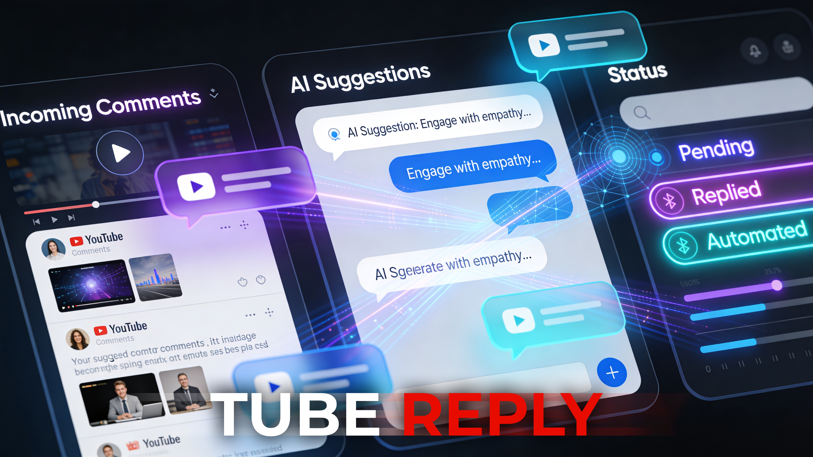

<p align="center">
  
</p>

# Tube Reply

_🇪🇸 [Leer en Español](./README.es.md)_

AI-powered YouTube comment management tool and Channel Assistant. Syncs comments from your channel, generates AI reply suggestions via Google Gemini, and features a dedicated AI Agent to assist with channel queries and strategy — all from a single private dashboard.

---

## Features

- **Comment sync** — pulls top-level comments from all channel videos via YouTube Data API v3
- **AI reply suggestions** — generated via Google Gemini or OpenAI, informed by your Knowledge Base
- **Language detection & Overrides** — auto-detects language (20+ languages) and allows manual overrides
- **Video summaries** — AI-generated per-video summaries used as context for reply generation
- **Knowledge Base** — train the AI with channel style guides, FAQs, personas, topics, and custom rules. **Now with AI-powered auto-generation** based on your channel's real data
- **One-click publish** — approve and post replies directly to YouTube without leaving the app
- **User Banning** — Block problematic users from your channel with one click
- **Bulk Moderation** — Approve, dismiss, or skip multiple comments at once
- **AI Channel Agent** — specialized chatbot to brainstorm video ideas, analyze channel growth, and query your database context
- **Provider Switching** — Switch between Google Gemini and OpenAI models on-the-fly via settings
- **Quota management** — tracks daily YouTube API quota, configurable cap
- **Security** — Rate limiting, CSRF protection, and AES-256-GCM token encryption
- **PWA support** — installable web app with offline capabilities and custom icons
- **Responsive Design** — Fully optimized for desktop, tablet, and mobile devices with a premium dark-mode aesthetic

---

## Tech Stack

| Layer      | Tech                                  |
| ---------- | ------------------------------------- |
| Framework  | Nuxt 3                                |
| UI         | Vue 3 + @nuxt/ui + Tailwind CSS       |
| Database   | **SQLite** (better-sqlite3) + Drizzle |
| AI         | Google Gemini & OpenAI                |
| YouTube    | Google APIs OAuth2 (`googleapis`)     |
| Auth       | Session cookie + bcrypt password hash |
| Encryption | AES-256-GCM (token storage)           |
| PWA        | @vite-pwa/nuxt                        |

---

## Database Management

Tube Reply uses **SQLite** for its simplicity and portability. One of the core features is its **Auto-Migration System**:

- **No Manual Setup Required**: The app automatically detects if the database file exists.
- **Auto-Provisioning**: On the first run, it creates the database file and all necessary tables.
- **Zero-Config Migrations**: Every time the app starts, it checks for pending schema updates and applies them automatically. You don't need to run `npm run db:migrate` manually (although it's available for advanced use).

---

## AI Intelligence & Models

Tube Reply is highly optimized for performance and cost-efficiency. It uses **Mini/Flash** models that provide premium reasoning at a fraction of the cost of standard models.

### Model Comparison & Pricing (per 1M tokens)

| Feature            | GPT-4o mini       | Gemini 3.0 Flash Preview           |
| :----------------- | :---------------- | :--------------------------------- |
| **Input Price**    | $0.15             | $0.50                              |
| **Cached Input**   | $0.075            | $0.05                              |
| **Output Price**   | $0.60             | $3.00                              |
| **Context Window** | 128K tokens       | 1M+ tokens                         |
| **Specialty**      | Precision & Logic | Massive Context & Google Grounding |

> [!NOTE]
> **Gemini 3 Flash** also supports "Grounding with Google Search" for real-time information and deep integration with Google Maps.

### Typical Use Case & Cost Estimation

In a typical scenario with **200 videos in your database** and an active **Knowledge Base** (Style guides, FAQs):

- **Average Context per Request**: ~2,500 - 3,500 tokens (includes Knowledge Base entries, video title, AI-generated video summary, and recent video titles for referencing).
- **Average Output**: ~150 - 250 tokens (the actual reply).

**Estimated Cost (GPT-4o mini):**

- **100 replies**: ~$0.05 USD
- **1,000 replies**: ~$0.50 USD

**Estimated Cost (Gemini 3.0 Flash Preview):**

- **100 replies**: ~$0.19 USD
- **1,000 replies**: ~$1.85 USD

### Intelligence Features

- **DDBB-Backed Context (RAG)**: The app uses its internal **SQLite database** to provide real-time context. If a user asks _"Where is the video about X?"_, the AI uses **Function Calling** to search the DDBB for relevant video titles and thumbnails to provide a grounded answer with valid links.
- **Hallucination Protection**: Every link generated by the AI is cross-referenced against the database. Any "hallucinated" video IDs are automatically stripped out before the suggestion is saved.
- **Auto-Summarization**: On the first request for a video, the system automatically generates a concise AI summary of the video content to use as permanent context for all future comments on that video.
- **User Moderation**:
  - **One-Click Ban**: Uses YouTube API to reject the comment and ban the author from the channel.
  - **Local Tracking**: Banned authors are saved in the database. All their existing and future comments are automatically marked as "Dismissed".
  - **Unban**: Restore authors locally with one click. (Manual removal from YouTube Studio is still required for full restoration).
- **Automatic AI Suggestions**: When enabled in Settings, the system automatically triggers the AI suggestion engine after every successful synchronization.
  - **Sequential Processing**: To respect AI provider rate limits (RPM), comments are processed one-by-one with a built-in delay.
  - **Smart Selection**: It only targets top-level "Pending" comments that don't already have an AI suggestion, preventing redundant API calls.
  - **Background Execution**: The process runs in the background, allowing you to continue using the dashboard while suggestions are being generated.
- **AI Channel Agent**: A dedicated internal chat interface powered by Gemini Flash that acts as your channel consultant. It has full access to your database context (video history, summaries, and knowledge base) to help you brainstorm new content, answer specific questions about your channel, or refine your strategy.
- **AI Knowledge Base Generation**: Automatically expand your knowledge base by letting the AI analyze your top videos and most frequent user questions. It identifies patterns and suggests new FAQs, style rules, and context entries to keep your AI's responses accurate and up-to-date with minimal effort.
- **Automated Scheduler**: The system includes a background scheduler that performs "Deep Scans" of your channel (all videos) 4 times a day (every 6 hours) to ensure all comments are synced and AI suggestions are triggered automatically.

---

## YouTube API Quota & Smart Synchronization

Tube Reply features a highly optimized synchronization engine designed to minimize API quota consumption while keeping your comments up-to-date.

- **Daily Free Quota**: 10,000 units.
- **Smart Sync (Default)**: Uses a channel-wide optimized query (`allThreadsRelatedToChannelId`) to fetch the latest comments from the entire channel in one go.
  - **Cost**: ~1-5 units per sync.
  - **Frequency**: Every 30-60 minutes (configurable).
  - **Benefit**: Even with 3,000+ videos, a manual or scheduled "recent" sync only uses a handful of quota units.
- **Deep Sync**: Performs a full scan of all videos in your channel to catch comments on older content.
  - **Cost**: ~1 unit per video.
  - **Frequency**: 4 times per day (every 6 hours) by default.
  - **Example**: If you have 1,000 videos, one deep sync uses 1,000 units.
- **Replying Cost**: Posting a comment reply costs **50 units** per action.
- **Quota Guard**: The app tracks your daily consumption and automatically stops syncing if you approach your daily limit (configurable in `.env`).

---

## Requirements

- Node.js 20+ (Tested on 25.9.0)
- Google Cloud project with:
  - YouTube Data API v3 enabled
  - OAuth 2.0 credentials (Web application type)
- Google AI Studio API key (Gemini) or OpenAI API key

---

## Setup

### 1. Install dependencies

```bash
npm install
```

### 2. Configure environment

Copy `.env.example` to `.env` and fill in all values:

```bash
cp .env.example .env
```

| Variable                          | Description                                              |
| --------------------------------- | -------------------------------------------------------- |
| `ADMIN_PASSWORD_HASH`             | bcrypt hash — generate with `npm run hash-password`      |
| `SESSION_DURATION_HOURS`          | Session TTL (default: `24`)                              |
| `DATABASE_URL`                    | SQLite file path (default: `./data/youtube.db`)          |
| `YOUTUBE_CLIENT_ID`               | OAuth2 client ID from Google Cloud Console               |
| `YOUTUBE_CLIENT_SECRET`           | OAuth2 client secret                                     |
| `YOUTUBE_REDIRECT_URI`            | Must match authorized redirect in Google Cloud Console   |
| `GEMINI_API_KEY`                  | Google AI Studio API key                                 |
| `GEMINI_MODEL`                    | Gemini model ID (e.g. `gemini-3-flash-preview`)          |
| `OPENAI_API_KEY`                  | OpenAI API key                                           |
| `OPENAI_MODEL`                    | OpenAI model ID (e.g. `gpt-4o-mini`)                     |
| `AI_PROVIDER`                     | Default provider: `gemini` or `openai`                   |
| `TOKEN_ENCRYPTION_KEY`            | 64 hex chars (32 bytes) for AES-256-GCM token encryption |
| `SYNC_INTERVAL_MINUTES`           | Auto-sync interval (default: `30`)                       |
| `AUTO_SYNC_ON_START`              | Sync comments when server starts (default: `true`)       |
| `MAX_QUOTA_PER_DAY`               | YouTube API quota ceiling (default: `8500`)              |
| `RATE_LIMIT_LOGIN_MAX`            | Max login attempts per window (default: `5`)             |
| `RATE_LIMIT_LOGIN_WINDOW_MINUTES` | Login rate-limit window (default: `15`)                  |
| `LOCKOUT_DURATION_MINUTES`        | Lockout duration after failed logins (default: `30`)     |
| `LOG_RETENTION_DAYS`              | Days to keep error/activity logs (default: `30`)         |

**Generate secrets:**

```bash

# ADMIN_PASSWORD_HASH
npm run hash-password
```

### 3. Start development server

```bash
npm run dev
```

The database will be initialized and migrated automatically on start.
App runs at `http://localhost:3000`.

---

## Google Cloud Setup

1. Go to [Google Cloud Console](https://console.cloud.google.com/apis/credentials)
2. Create a new project (or use existing)
3. Enable **YouTube Data API v3**
4. Create **OAuth 2.0 Client ID** → Web application
5. Add authorized redirect URI: `http://localhost:3000/api/youtube/callback` (or your production URL)
6. Copy Client ID and Client Secret to `.env`

---

## YouTube OAuth Scopes

The app requests:

- `https://www.googleapis.com/auth/youtube.readonly` — read videos and comments
- `https://www.googleapis.com/auth/youtube.force-ssl` — post comment replies

---

## Scripts

| Command                 | Description                                |
| ----------------------- | ------------------------------------------ |
| `npm run dev`           | Start dev server                           |
| `npm run build`         | Build for production                       |
| `npm run preview`       | Preview production build                   |
| `npm run db:migrate`    | Run pending DB migrations                  |
| `npm run db:generate`   | Generate new migration from schema changes |
| `npm run db:push`       | Push schema directly (dev only)            |
| `npm run hash-password` | Generate bcrypt hash for admin password    |

---

## Knowledge Base Types

| Type    | Purpose                                 |
| ------- | --------------------------------------- |
| `faq`   | Common questions and approved answers   |
| `style` | Tone, voice, and personality guidelines |
| `info`  | Subject matter context and general info |
| `rule`  | Hard rules (things to always/never say) |

Active entries are injected as context into every AI prompt.

---

## Security Notes

- Admin access is single-user via bcrypt-hashed password in `.env`
- YouTube OAuth tokens stored encrypted (AES-256-GCM) in SQLite
- All state-changing API routes protected by CSRF middleware
- Login endpoint has rate limiting + IP-based lockout
- Sessions are HTTP-only signed cookies

---

## Production Deployment

### Standard Node.js

```bash
npm run build
node .output/server/index.mjs
```

### Plesk Deployment

If you are using **Plesk**, deployment is straightforward using the built-in Node.js extension:

1. **Application Root**: Your project directory.
2. **Document Root**: `/public`.
3. **Application Startup File**: `.output/server/index.mjs`.
4. **Environment Variables**: Add all your `.env` variables in the Plesk Node.js configuration panel.
5. **Workflow**:
   - Run **NPM Install**.
   - Run **NPM Run Build** (via SSH or the "Run script" button in Plesk).
   - Click **Restart App** to apply changes.

Update `YOUTUBE_REDIRECT_URI` and all secrets in your production environment. Never commit `.env` to version control.

---

## License

This project is licensed under the [MIT License](LICENSE) - 100% free to use, modify, and distribute.
